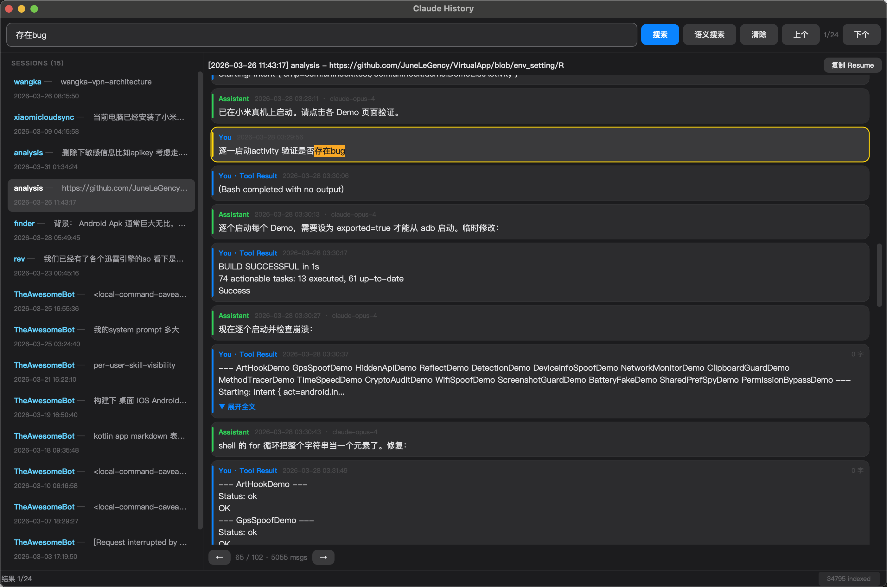

# Claude History Search

Search and browse [Claude Code](https://docs.anthropic.com/en/docs/claude-code) conversation history with keyword search, semantic search (local embedding), and a native Qt GUI.

 

**English** | [中文](README_CN.md)



## Features

- **Full-text keyword search** across all Claude Code sessions (`~/.claude/projects/`)
  - Multi-word AND matching, CJK punctuation-aware tokenization
  - Highlights matching text in messages, auto-jumps to matched position
  - Result navigation (`Cmd+G` / `Cmd+Shift+G`) to jump between matches across sessions
- **Semantic search** via local embedding model (Qwen3-Embedding-0.6B on MLX/Metal)
  - Incremental index with checkpoint save (crash-safe)
  - ModelScope or HuggingFace model download
- **Native Qt C++ GUI** with macOS dark/light mode (`Cmd+T` to toggle)
  - QPainter-rendered chat bubbles, collapsible long messages
  - Copy `claude --resume <session-id>` command with one click
  - Paginated message view with keyboard navigation
- **Fast C++ JSONL parser** with parallel loading (QtConcurrent) and structured `tool_result` extraction

## Install

### Option A: Homebrew (recommended)

```bash
brew tap JuneLeGency/claude-history-search
brew install claude-history-search
```

### Option B: Build from source

**Prerequisites:**
- Qt 6: `brew install qt@6`
- CMake 3.20+: `brew install cmake`
- (Optional) Python 3.10+ & uv for semantic search: `brew install uv`

**Build:**

```bash
git clone https://github.com/JuneLeGency/claude-history-search.git
cd claude-history-search/qt
mkdir build && cd build
cmake .. -DCMAKE_BUILD_TYPE=Release
cmake --build . --config Release
open claude-his-search.app
```

### Option C: Semantic search setup (optional)

Semantic search requires a local embedding model. First-time setup:

```bash
# Install Python dependencies
cd claude-history-search
uv sync --extra mlx

# Build embedding index (downloads ~1.2GB model on first run)
# Use the GUI: menu Index > Update Index
# Or via Python:
uv run python -c "
from claude_his_search.embedding_engine import EmbeddingEngine
from claude_his_search.config import AppConfig
from claude_his_search.history_parser import scan_all_sessions
config = AppConfig.load()
engine = EmbeddingEngine(config)
sessions = scan_all_sessions()
engine.build_index(sessions, progress_callback=lambda c,t,m: print(m))
"
```

## Usage

### Keyboard Shortcuts

| Shortcut | Action |
|----------|--------|
| `Cmd+F` | Focus search box |
| `Enter` | Keyword search |
| `Cmd+Shift+F` | Semantic search |
| `Escape` | Clear search |
| `Cmd+G` | Next result |
| `Cmd+Shift+G` | Previous result |
| `Cmd+[` | Previous page |
| `Cmd+]` | Next page |
| `Cmd+Shift+C` | Copy resume command |
| `Cmd+T` | Toggle dark/light mode |
| `Cmd+R` | Refresh sessions |
| `Cmd+U` | Update index |

### How It Works

1. Scans `~/.claude/projects/` for all conversation JSONL files
2. Parses messages with structured extraction (text + tool_result content)
3. Pre-computes normalized search text per session for fast keyword matching
4. (Optional) Builds vector embeddings with Qwen3-Embedding-0.6B via MLX on Apple Silicon

### Data & Index Location

| Path | Contents |
|------|----------|
| `~/.claude/projects/` | Claude Code conversation history (read-only) |
| `~/.claude_his_search/config.json` | App settings |
| `~/.claude_his_search/index/` | Embedding vector index (incremental, crash-safe) |
| `~/.cache/claude-his-search/projects/` | Parsed session cache (bincode) |

## Project Structure

```
qt/                         # Native Qt C++ GUI (main application)
  CMakeLists.txt
  main.cpp                  # Entry point
  types.h                   # Data structures
  parser.h/cpp              # JSONL parser (parallel, CJK-aware)
  engine.h/cpp              # Embedding engine (calls Python MLX subprocess)
  chatwidget.h              # QPainter chat bubbles, collapsible messages
  mainwindow.h/cpp          # Main window, menus, search, navigation

claude_his_search/          # Python embedding backend
  config.py                 # Configuration
  history_parser.py         # Python JSONL parser
  embedding_engine.py       # MLX/PyTorch local embedding (Qwen3-0.6B)

src/                        # Rust backend (alternative parser, experimental)
  main.rs, parser.rs, ...
```

## Credits

- [claude-history](https://github.com/raine/claude-history) for JSONL parsing patterns and search scoring ideas
- [Qwen3-Embedding](https://huggingface.co/Qwen/Qwen3-Embedding-0.6B) for the local embedding model
- [MLX](https://github.com/ml-explore/mlx) for Apple Silicon ML inference

## License

MIT
